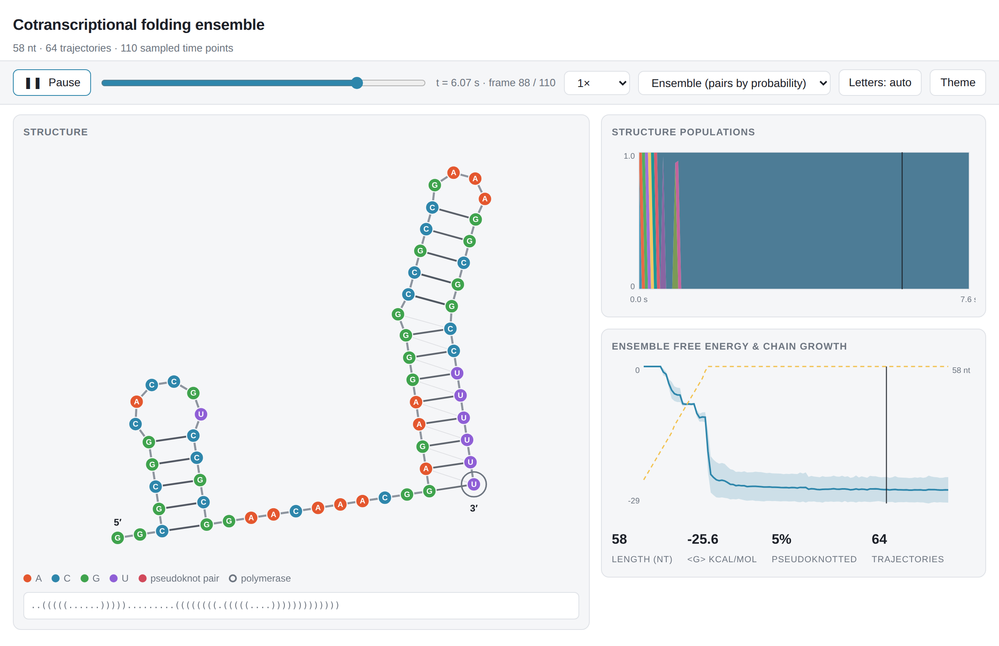
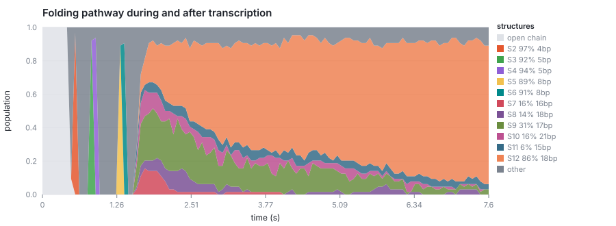
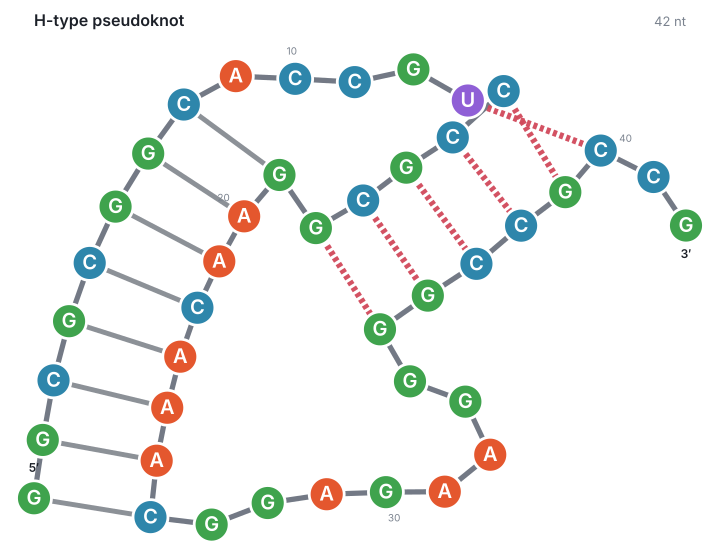
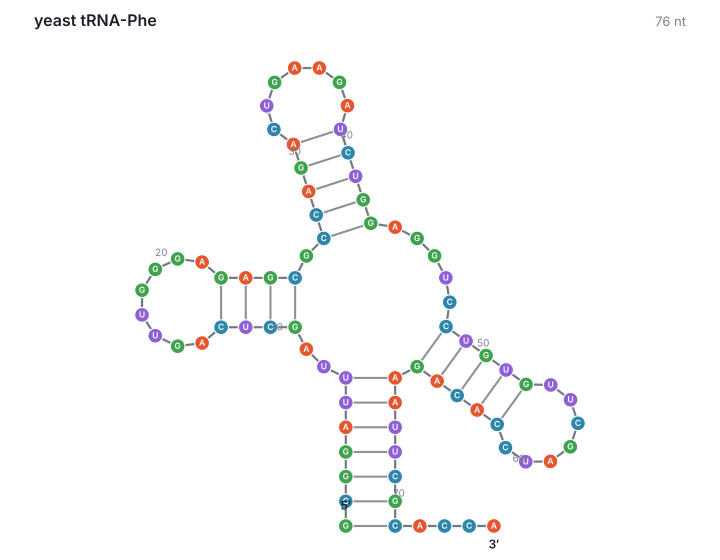

# rona

**Cotranscriptional RNA folding kinetics.** `rona` simulates how an RNA
transcript folds *while it is being synthesised*, as a stochastic kinetic
process over structure space. The output is a time-resolved **kinetic
ensemble**: the distribution over structures at each moment during and after
transcription.

It is pseudoknot-aware, and it renders the result as figures, movies and an
interactive player.

---

## What this is, and what it is not

Most structure-prediction tools answer an equilibrium question: *given this
sequence, what is the Boltzmann ensemble?* That is the wrong question for an RNA
that has to act while it is being made. A transcriptional riboswitch commits to
a terminator or an antiterminator within milliseconds of the decision point, and
never re-equilibrates.

A common approximation is to fold every prefix of the sequence to equilibrium
and report the series — "stepwise equilibrium". That is not kinetics. It has no
timescale, no barriers, and no memory, so it cannot produce a folding trap,
which is precisely the phenomenon that makes cotranscriptional folding
interesting.

`rona` runs the actual master equation:

```
dP/dt = K P
```

by exact Gillespie sampling, with the chain growing underneath the simulation.
Nothing is re-equilibrated at any length. A structure that forms early persists
until the kinetics melts it.

| | equilibrium folding | stepwise equilibrium | `rona` |
|---|---|---|---|
| has a timescale | no | no | **yes (seconds)** |
| barriers matter | no | no | **yes** |
| can be trapped | no | no | **yes** |
| elongation rate matters | no | no | **yes** |
| pause sites matter | no | no | **yes** |
| pseudoknots | model-dependent | model-dependent | **yes** |

<p align="center">
  
</p>

---

## Install

```bash
pip install -e .            # core: numpy only
pip install -e '.[movie]'   # + matplotlib, imageio, ffmpeg for MP4/GIF
pip install -e '.[dev]'     # + pytest and ViennaRNA for the validation suite
```

Python 3.10+.

## Quick start

```bash
# simulate, then write an interactive player, SVG figures and a movie
rona fold my_rna.fa -n 200 --html --svg --json --movie folding.mp4

# one stochastic pathway, printed
rona trajectory GGCGCGGCACCGUCCGCGGAACAAACGGAGAAGGGGCCGCCG --changes-only

# what the move set looks like for a sequence
rona info my_rna.fa
```

```python
from rona import simulate_ensemble, SimulationConfig, TranscriptionSchedule

config = SimulationConfig(
    transcription=TranscriptionSchedule(
        rate=30.0,          # nt/s
        footprint=10,       # nt held inside the polymerase
        pauses=(),          # e.g. (Pause(position=72, duration=3.0),)
        post_time=20.0,     # folding time after release
    ),
)
ensemble = simulate_ensemble("GGGAAACCC...", config, n_trajectories=200)

structure, population = ensemble.dominant()[-1]
probabilities = ensemble.pair_probabilities()   # P[t, i, j]
labels, bands = ensemble.occupancy()            # the folding pathway
```

---

## A worked result

A designed folding trap, 44 nt. Segment A pairs with the nearby A′ the moment
A′ is transcribed — a local, fast, 8 bp hairpin. The global free-energy minimum
instead pairs A′ with the *later* A″, an 11 bp helix worth 2.2 kcal/mol more.

| | structure | ΔG (kcal/mol) |
|---|---|---|
| ViennaRNA MFE | `............(((((((((((.((....)).)))))))))))` | −16.8 |
| local trap | `((((((((....))))))))........................` | −14.6 |
| **rona, cotranscriptional at 30 nt/s** | **83% reach the long-range structure** | |

> **A correction worth reading.** An earlier version of this README reported
> that 100% of the ensemble stayed in the local trap. That was an artefact.
> The helix move set could not extend a helix once formed, so a hairpin that
> nucleated behind the polymerase was frozen at its initial length and the only
> way out was to melt all eight pairs at once — a barrier the simulation could
> never cross. With zipping added (see `docs/methods.md` §2) the trap is escaped
> one base pair at a time, as it is in reality, and the answer changes. The
> defect was found by a per-transition detailed-balance test, not by inspection.

<p align="center">
  
</p>

Structure populations through a run. Each band is a distinct structure; the plot
reads left-to-right as the folding pathway.

<p align="center">
  
  
</p>

---

## The model

### Energy

The full **Turner 2004** nearest-neighbour model, read from the standard
parameter tables shipped in `rona/params/`: stacking, hairpin, bulge and
interior loops including the tabulated 1×1 / 2×1 / 2×2 values, the special
tri-, tetra- and hexaloop bonuses, linear multiloops, terminal mismatches and
dangling ends, with temperature extrapolation from the enthalpy tables.

This is checked against ViennaRNA, not merely believed: on ~3000 random
structures at 37 °C, and on MFE structures from 4–90 °C with both dangle
models, the worst absolute deviation is **0.009 kcal/mol** — dekacalorie
rounding and nothing else.

### Move set

Folding is simulated at the level of **helices**, because that is what produces
the right separation of timescales.

* `helix` (default) — a move forms the longest currently-unobstructed ladder of
  a maximal stem, or melts a formed helix whole. Single-base-pair zipping is
  coarse-grained away. It has to be: adding one pair to an existing helix end
  takes ~100 ns against ~10 µs for a nucleation event, so resolving it
  explicitly costs ~10⁸ events per simulated second while leaving the coarse
  folding pathway unchanged.
* `breathe` — base-pair resolution: helices nucleate at a fixed window and then
  zip or unzip one pair at a time. Physically finer, much more expensive.

### Rates

Each move and its reverse get rates satisfying detailed balance with respect to
the Turner free energy:

```
metropolis (default)   k = k0 · exp(−max(0, ΔG) / RT)
kawasaki               k = k0 · exp(−ΔG / 2RT)
```

The prefactor `k0` differs by move class — `k_nucleate ≈ 10⁵ s⁻¹` for forming or
melting a helix, `k_zip ≈ 10⁷ s⁻¹` for a single pair — and that difference is
what makes the simulation kinetic rather than merely thermodynamic. Helices
appear rarely and complete quickly, so the transcript gets trapped the way a
real one does.

### Transcription

Elongation at a configurable rate (default 30 nt/s), an RNA polymerase
footprint that sequesters the last ~10 nucleotides from pairing, arbitrary
pause sites with fixed or exponentially-distributed dwell times, and a
post-transcriptional folding window.

### Pseudoknots

The nearest-neighbour model is only defined on a loop decomposition, which
exists only for nested structures. `rona` splits each state into a nested
**core**, scored exactly, plus the **crossing helices** that had to be removed.
Each crossing helix contributes its own stacking energy, its terminal penalties,
and a topology penalty of the form used by Dirks & Pierce (2003):

```
ΔG_pk = init + per_unpaired · n_unpaired + per_branch · n_crossed
```

evaluated over the *pseudoknot region* — the window jointly spanned by the
crossing helix and the core helices it threads through — so the linear term
stays bounded however long the transcript is.

The defaults (`init = 7.0`, `per_unpaired = 0.1`, `per_branch = 0.2` kcal/mol)
are a deliberately simple, transparent parameterisation, **not a fitted
parameter set**. They are chosen so that characterised H-type pseudoknots form
during simulation while incidental crossings do not. Tune them with
`--pk-init`, `--pk-unpaired`, `--pk-branch`, or switch pseudoknots off entirely
with `--no-pseudoknots`.

---

## Validation

### Against experiment

Cotranscriptional SHAPE-seq measures, for every transcript length, how reactive
each nucleotide is. That is a length × position observable, exactly the shape of
what a cotranscriptional simulation predicts, so it is the most direct public
test available. Scored against the *B. cereus* crcB fluoride riboswitch probing
matrix from the [RNA Mapping Database](https://rmdb.stanford.edu/)
(108 transcript lengths, 127 nt, 6,195 comparable points):

| method | Spearman ρ | median per-length ρ | AUROC |
|---|---|---|---|
| **rona** (16 trajectories) | **+0.289** | +0.311 | **+0.642** |
| stepwise equilibrium (ViennaRNA per prefix) | +0.249 | **+0.313** | 0.633 |
| DrTransformer 2.x | +0.223 | +0.239 | 0.575 |

`python examples/06_shape_benchmark.py` reproduces it; the script downloads the
data itself.

Three caveats that matter. The correlations are modest for *everything* — SHAPE
reports 2′-OH flexibility, not base pairing. The margins between the three are
small, and this is one RNA under one condition. And the roadblock protocol
probes *stalled* complexes, which sits much closer to per-length equilibrium
than to free elongation, so this dataset should if anything favour the
equilibrium baseline. See `docs/validation.md`.

### Against its own equilibrium

The load-bearing internal test is that the simulator reproduces equilibrium when
it should. For four fixed-length systems — including one with pseudoknots enabled
and one in `breathe` mode — the time-weighted occupancy of a 250 000-event run
matches the exact Boltzmann distribution over the fully enumerated reachable
state space to within **0.05 total-variation distance**.

That test is what makes a cotranscriptional run meaningful: it is the same
machinery, with the chain growing underneath it. It also found two real bugs
during development (a Fenwick-tree total that was only correct for
power-of-two sizes, and a candidate-activation order that assumed stems were
enumerated by 3′ end).

```bash
pytest -q          # ~60 s; skips the ViennaRNA comparison if it is not installed
```

---

## Rendering

`rona` treats the picture as part of the result, because a kinetic ensemble is a
film, not a frame.

* **Interactive player** (`--html`) — one self-contained HTML file, no server
  and no dependencies. Scrub and play through the time course; the structure
  morphs between sampled points, base pairs are shaded by their *ensemble*
  probability, and the population and energy panels carry a synchronised cursor.
* **Movie** (`--movie out.mp4` or `.gif`) — a multi-panel animation. In the
  default `ensemble` mode every pair's opacity is its ensemble probability, so
  the film shows the whole distribution committing, not one trajectory.
* **SVG figures** (`--svg`) — stacked structure populations over time, ensemble
  free energy with chain growth, the pairing-probability dot plot, the
  pseudoknotted fraction, and the final dominant structure.

The layout deserves a note. The nested part of a structure is drawn with the
classical loop-circle construction: every loop is a circle sized so its members
fit exactly, every helix a straight ladder. Crossing pairs cannot be honoured by
that construction, so each pseudoknot helix is first snapped onto a rigid
ladder by a Kabsch fit and the drawing is then relaxed around it — springs alone
reliably settle into a knotted local minimum. For movies, each frame is seeded
from the previous one and rigidly superposed onto it, then tweened with
smoothstep easing, so the structure visibly *morphs* instead of being redrawn.

---

## Limitations

Worth being straight about.

* **Sequence length is the binding constraint: practical to roughly 60–80 nt.**
  The simulator resolves every elementary event, and zipping a pair onto a helix
  end is a *futile* fast mode — measured on a 58 nt transcript, **99.7% of all
  events are zip/unzip**, with forward and reverse counts equal to three
  significant figures. Above this size DrTransformer is the better tool for
  nested structures, and it is not close: it handled a 127 nt input in seconds.
  Removing the fast mode properly means lumping the helix-length degree of
  freedom, which does not factorise cleanly because helices compete for
  nucleotides — see `docs/methods.md`. That is the main open problem.
* **`k_zip` is a convergence parameter, not just a rate.** The default (10⁶ s⁻¹)
  is below the physical ~10⁷ s⁻¹ because event count scales linearly with it
  while the coarse result should not. `examples/05_timescale_separation.py`
  checks that on your sequence rather than asking you to take it on trust.
* **Pseudoknot energetics are approximate.** The Turner model has no fitted
  pseudoknot parameters; the topology penalty here is a transparent functional
  form with tunable constants, not a measured parameter set. Treat pseudoknot
  populations as qualitative.
* **One experimental benchmark, narrow margins.** rona comes out ahead on the
  fluoride-riboswitch probing data, but on one RNA under one condition and by a
  small amount. Treat it as encouraging, not as established.
* **No tertiary structure, no ions beyond the implicit 1 M Na⁺ of the Turner
  parameters, no ligands, no proteins.**
* **The polymerase is a moving boundary, nothing more.** No backtracking, no
  sequence-dependent elongation, no transcription-coupled folding forces.

## Further reading

* `docs/methods.md` — what is worth borrowing from Kinefold, DrTransformer,
  Kinfold, CoStochFold and DrForna, and what has been taken already.
* `docs/validation.md` — the three levels of checking, the public probing data,
  and the measured baselines.

## Background

`rona` builds on a substantial literature rather than starting from scratch:
Turner's nearest-neighbour thermodynamics; Flamm & Hofacker's `Kinfold` for
base-pair-level stochastic folding; Isambert & Siggia's `Kinefold` for
helix-level moves and cotranscriptional folding; Hofacker et al.'s `Kinwalker`
and Badelt et al.'s `DrTransformer` for cotranscriptional pathway prediction;
Dirks & Pierce for pseudoknot energetics; and `DrForna` for the stacked-population
view of a folding pathway. The ViennaRNA package is used here as an independent
reference implementation to validate the energy model.

## License

MIT.
